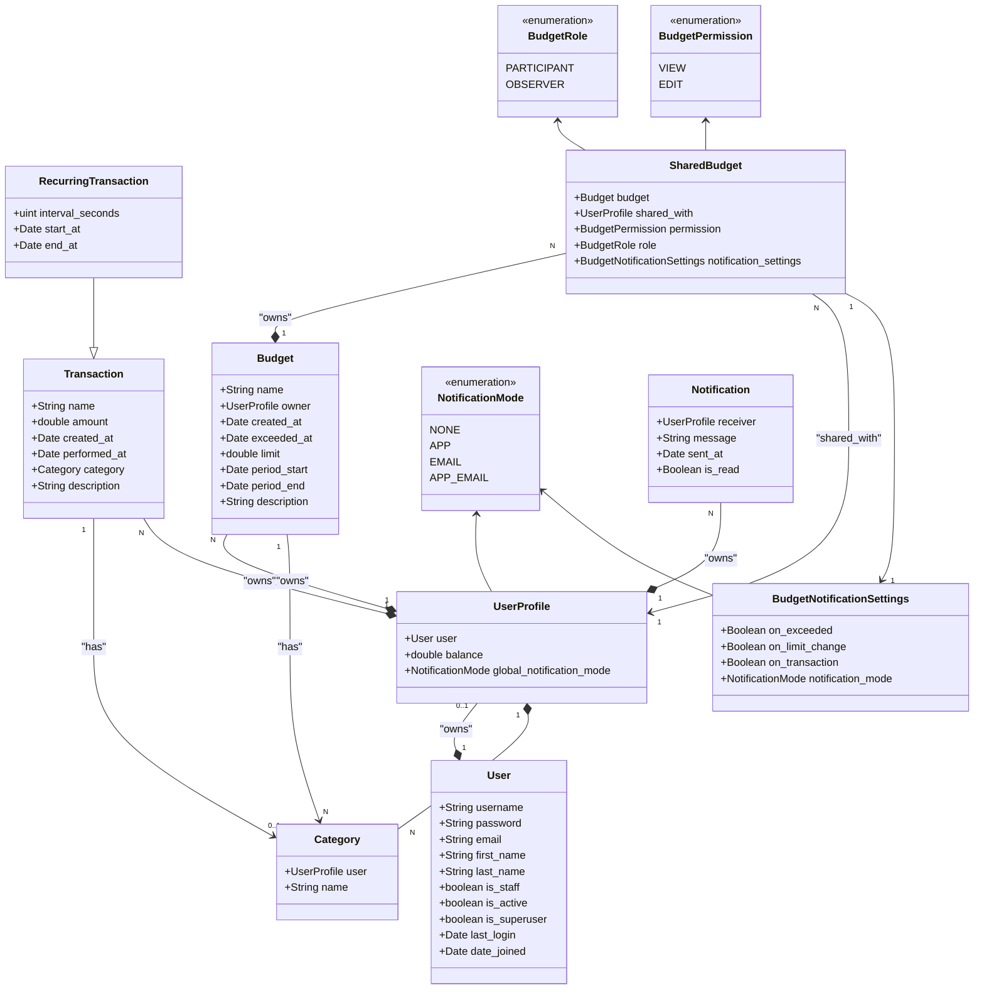

## First time setup
```bash
python -m venv env
.\env\Scripts\activate
pip install -r requirements.txt
python manage.py migrate
python manage.py runserver
```

## If project is already setup
```bash
.\env\Scripts\activate
python manage.py migrate
python manage.py runserver
```

## Linting
Format = process which checks/fixes indentation, spacing and similar. Can be fixed automatically

Linting = process which checks for rules (snake_case for variables for example). Cannot be automatically fixed

Setup uses 3 linters and formatters.

DJlint will automatically format django files (.html), then it will run lint, which will show you linting problems in .html files that you should to fix.

After that, Black will automatically format python files, then Flake8 will run lint, which will show you linting problems in .py files that you should to fix.

### Linting locally

#### Check formatting problems in html files
```bash
djlint . --check
```

#### Automatically fix formatting in html files
```bash
djlint . --reformat
```

#### Check for linting problems in html files
```bash
djlint . --lint
```

#### Automatically fix formatting problems in python files
```bash
black .
```

#### Check for linting problems in python files
```bash
flake8
```


## If you want to check it on the phone
```bash
python manage.py runserver 0.0.0.0:8000
```
1. Find your PC's local IP with ipconfig
2. Add it to ALLOWED_HOSTS in finance-management-system/project/settings.py
3. Connect to that IP with same port on your phone

## Resources

[Google doc](https://docs.google.com/document/d/1CBFf9SYnnrxeE0lQ2UtjCQK5ZHMXkhcF/edit?usp=sharing&ouid=106305257367534443251&rtpof=true&sd=true)

[UI mockup](https://www.figma.com/design/eYu9ELOc3WdKGwBth3F1sO/Untitled?node-id=0-1&node-type=canvas)

## UML diagram


