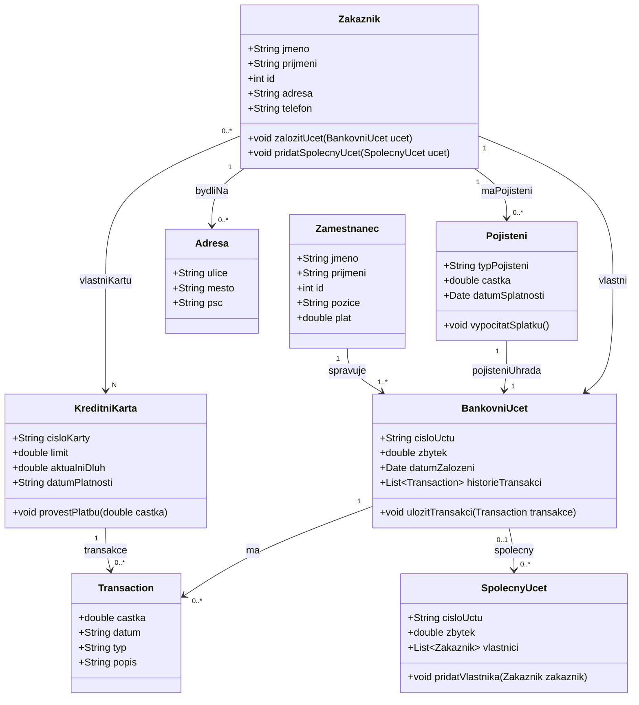

## First time setup (windows)
```bash
python -m venv env
.\env\Scripts\activate
pip install -r requirements.txt
python manage.py migrate
python manage.py runserver

```

## If project is already setup
```bash
.\env\Scripts\activate
python manage.py migrate
python manage.py runserver
```

## If you want to check it on the phone
```bash
python manage.py runserver 0.0.0.0:8000
```
1. Find your PC's local IP with ipconfig
2. Add it to ALLOWED_HOSTS in finance-management-system/project/settings.py
3. Connect to that IP with same port on your phone

## Resources

[Google doc](https://docs.google.com/document/d/1CBFf9SYnnrxeE0lQ2UtjCQK5ZHMXkhcF/edit?usp=sharing&ouid=106305257367534443251&rtpof=true&sd=true)

[UI mockup](https://www.figma.com/design/eYu9ELOc3WdKGwBth3F1sO/Untitled?node-id=0-1&node-type=canvas)

## UML diagram test


