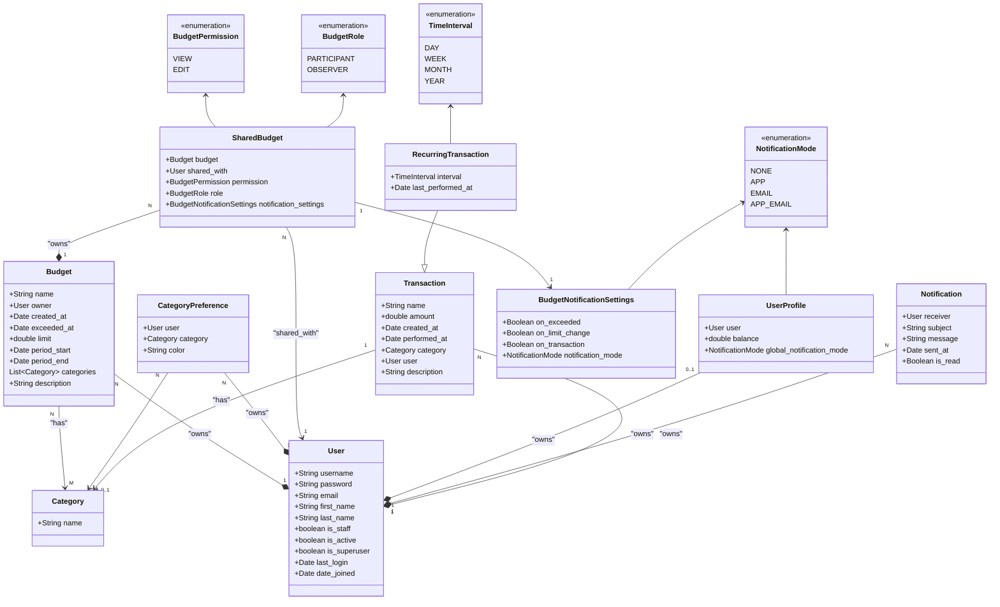

# Usage

## First time setup
```bash
python -m venv env
.\env\Scripts\activate
pip install -r requirements.txt
python manage.py migrate
python manage.py populate_db
python manage.py runserver
```

## If project is already setup
```bash
.\env\Scripts\activate
del db.sqlite3
python manage.py clear_db
python manage.py migrate
python manage.py populate_db
python manage.py runserver
```

If you have problems with database, you can try deleting the ```db.sqlite3``` file

## If you want to check the website on your phone
1. Run server on 0.0.0.0:8000
    ```bash
    python manage.py runserver 0.0.0.0:8000
    ```
2. Find your PC's local IP with ipconfig (usually something like 192.168.0.101)
3. Add the local IP to ALLOWED_HOSTS in finance-management-system/project/settings.py
4. While connected to the same network as PC, connect to that IP with same port on your phone (for example 192.168.0.101:8000)

# Linting
Formatting = process which checks/fixes indentation, spacing and similar. Can be fixed automatically

Linting = process which checks for rules (snake_case for variables for example). Cannot be automatically fixed

Setup uses 3 linters and formatters in this process, you can run it locally or commit it to github and it will automatically run:

1. DJlint will automatically format django files (.html)
2. Black will automatically format python files
3. (if it runs on github) If changes were made, it will fix the files and commits them to repo
4. DJlint will run lint, which will show you linting problems in .html files that you should to fix
5. Flake8 will run lint, which will show you linting problems in .py files that you should to fix

## Linting locally

### Automatically fix formatting in html files
```bash
djlint . --reformat
```

### Automatically fix formatting in python files
```bash
black .
```

### Check for linting problems in html files
```bash
djlint . --lint
```

### Check for linting problems in python files
```bash
flake8
```

## Tests
You can run tests locally using:
```bash
python manage.py test
```

## Resources

[Google doc](https://docs.google.com/document/d/1CBFf9SYnnrxeE0lQ2UtjCQK5ZHMXkhcF/edit?usp=sharing&ouid=106305257367534443251&rtpof=true&sd=true)

[UI mockup](https://www.figma.com/design/eYu9ELOc3WdKGwBth3F1sO/Untitled?node-id=0-1&node-type=canvas)

## UML diagram


